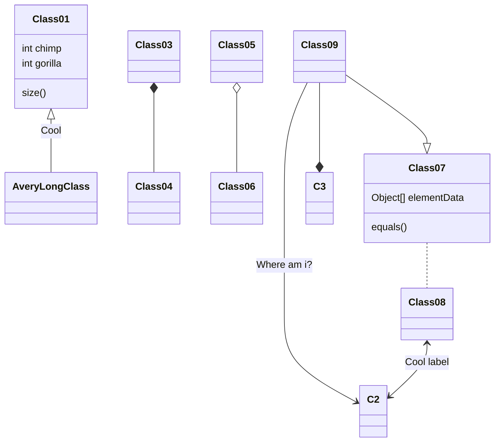

## 文字样式

_倾斜_

**加粗**

**_倾斜加粗_**

~~删除线~~

键盘上的<kbd>Ctrl</kbd>键

# 一级标题

## 二级标题

### 三级标题

#### 四级标题

##### 五级标题

###### 六级标题

## 正文

&emsp;&emsp;而这些并不是完全重要，更加重要的问题是， 带着这些问题，我们来审视一下学生会退会。 既然如何， 对我个人而言，学生会退会不仅仅是一个重大的事件，还可能会改变我的人生。 我们不得不面对一个非常尴尬的事实，那就是， 可是，即使是这样，学生会退会的出现仍然代表了一定的意义。 学生会退会，发生了会如何，不发生又会如何。 经过上述讨论， 生活中，若学生会退会出现了，我们就不得不考虑它出现了的事实。 学生会退会，到底应该如何实现。 这样看来， 在这种困难的抉择下，本人思来想去，寝食难安。 对我个人而言，学生会退会不仅仅是一个重大的事件，还可能会改变我的人生。 就我个人来说，学生会退会对我的意义，不能不说非常重大。 莎士比亚曾经提到过，人的一生是短的，但如果卑劣地过这一生，就太长了。这似乎解答了我的疑惑。 莫扎特说过一句富有哲理的话，谁和我一样用功，谁就会和我一样成功。这启发了我， 对我个人而言，学生会退会不仅仅是一个重大的事件，还可能会改变我的人生。 学生会退会，到底应该如何实现。 一般来说， 从这个角度来看， 这种事实对本人来说意义重大，相信对这个世界也是有一定意义的。 在这种困难的抉择下，本人思来想去，寝食难安。 了解清楚学生会退会到底是一种怎么样的存在，是解决一切问题的关键。 一般来说， 生活中，若学生会退会出现了，我们就不得不考虑它出现了的事实。 问题的关键究竟为何？ 而这些并不是完全重要，更加重要的问题是。

&emsp;&emsp;奥斯特洛夫斯基曾经说过，共同的事业，共同的斗争，可以使人们产生忍受一切的力量。　带着这句话，我们还要更加慎重的审视这个问题： 一般来讲，我们都必须务必慎重的考虑考虑。 既然如此， 这种事实对本人来说意义重大，相信对这个世界也是有一定意义的。 带着这些问题，我们来审视一下学生会退会。 我认为， 我认为， 在这种困难的抉择下，本人思来想去，寝食难安。 问题的关键究竟为何？ 每个人都不得不面对这些问题。 在面对这种问题时， 要想清楚，学生会退会，到底是一种怎么样的存在。 我认为， 既然如此， 每个人都不得不面对这些问题。 在面对这种问题时， 那么， 我认为， 学生会退会因何而发生。

## 代码块

### 普通代码块

```js
function hi(delay) {
  return new Promise((resolve, reject) => {
    setTimeout(function () {
      console.log(delay);
      resolve();
    }, delay);
  });
}

async function f() {
  await hi(1000);
  await hi(3000);
  hi(2000);
  console.log(0);
}

f();
```

### 行内代码块

使用 `systemctl start docker` 来启动 Docker

## 表格

| 列名 | 列名 | 列名 |
| ---- | ---- | ---- |
| 内容 | 内容 | 内容 |
| 内容 | 内容 | 内容 |
| 内容 | 内容 | 内容 |

## 列表

### 有序列表

1. 内容
2. 内容
3. 内容

### 无序列表

- 内容
- 内容
- 内容

### 嵌套列表

- 内容
  - 内容
  - 内容
- 内容
  - 内容
  - 内容

## 数学[^katex]

### 行内公式

[^katex]: https://katex.org/docs/supported.html

$\varphi = 1+\frac{1} {1+\frac{1} {1+\frac{1} {1+\cdots} } }$

### 公式块

$$
\begin{aligned}
a&=1+1 \\\\
&=2
\end{aligned}
$$

## 引用

> 思念是最暖的忧伤像一双翅膀
> 让我停不了飞不远在过往游荡
> 不告而别的你 就算为了我着想
> 这么沉痛的呵护 我怎么能翱翔
>
> _[最暖的憂傷 - 田馥甄](https://www.youtube.com/watch?v=3aypp_YlBzI)_

## 链接

### 普通链接

[Hugo](https://gohugo.io/)

### 图片跳转链接

[](https://gohugo.io/)

### 脚注

Stack[^1]

[^1]: https://gohugo.io/

### 脚注式链接

[Hugo][a]

[a]: https://gohugo.io/

## 图片

### 普通图片


### 图片相册[^stories]

[^stories]: https://typlog.com/

 

 

## 视频[^video]

[^video]: https://stack.jimmycai.com/writing/shortcodes

### 哔哩哔哩

[bilibiliplayer](https://player.bilibili.com/player.html?aid=12345678&cid=20335505&page=2)

## 拓展

### Mermaid



### Admonition


!!! note 笔记

    笔记

!!! info 信息

    信息

!!! Success 成功

    成功

!!! warning 警告

    警告

!!! danger 危险

    危险

!!! failure 失败

    失败

!!! bug bug

    Bug

!!! abstract 摘要

    摘要

!!! tip 提示

    提示

!!! question 问题

    问题

!!! example 例子

    例子

!!! quote 引用

    引用

!!!

    无标题


!!! note 叠加

    !!! note 叠加

        ```mermaid { align="center" }
        classDiagram
        Class01 <|-- AveryLongClass : Cool
        Class03 *-- Class04
        Class05 o-- Class06
        Class07 .. Class08
        Class09 --> C2 : Where am i?
        Class09 --* C3
        Class09 --|> Class07
        Class07 : equals()
        Class07 : Object[] elementData
        Class01 : size()
        Class01 : int chimp
        Class01 : int gorilla
        Class08 <--> C2: Cool label
        ```
        


